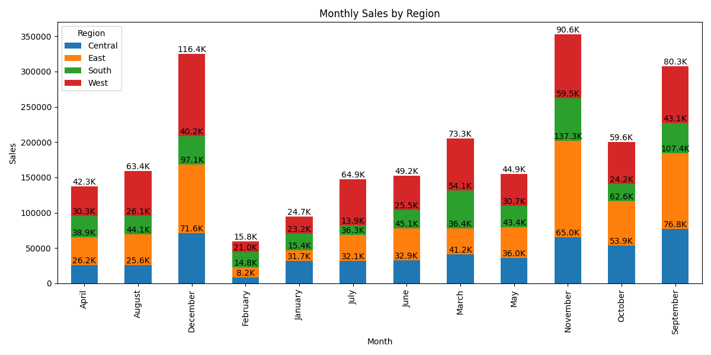
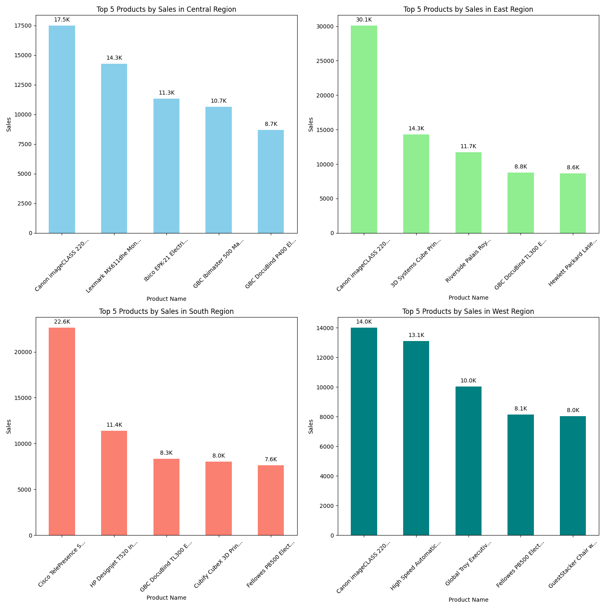
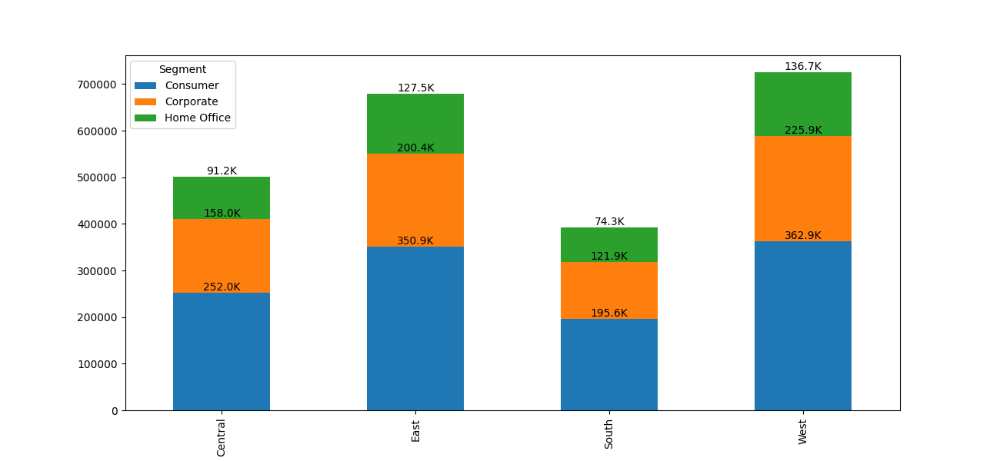
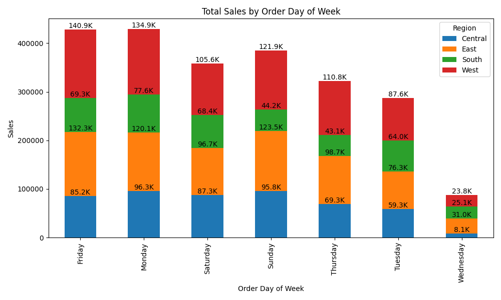

# Walmart Sales Performance Analysis  
## **Project Background** 

Walmart, established in 1962, is a global retail leader specializing in groceries and general merchandise. Operating through physical stores, a robust e-commerce platform, and mobile applications, Walmart has built an extensive presence worldwide.  

This project aims to leverage Walmart’s vast troves of data—spanning sales, shipping operations, product inventory, and customer behavior—to generate actionable insights. These findings are designed to drive business efficiency, optimize inventory, and improve profitability.  

The analysis focuses on four key areas:  
- **Sales Trends Analysis**  
- **Product-Level Performance**  
- **Regional Comparisons**  
- **Shipping and Operational Efficiency**  

## Access to Resources
- **SQL Queries:** [Data Inspection and Cleaning Queries](https://github.com/lakshaykamat/walmart-insights/blob/master/queries/Query.md)

- **Business-Specific Queries:** [Targeted SQL Queries](https://github.com/lakshaykamat/walmart-insights/blob/master/queries/Query.md#basic-business-analysis)

- **Tableau Dashboard:** [Sales Trends Visualization](https://public.tableau.com/app/profile/lakshay.kamat/viz/WalmartSalesDashboard_17360784456650/Dashboard1)
 

---

## **Data Overview**  

The dataset consists of four key tables: **Orders**, **Products**, **Sales**, and **Customers**, with a total of 9,995 records.  

Before diving into the analysis, rigorous quality checks were performed to ensure data accuracy and reliability. These checks covered missing values, data types, and outliers. The SQL queries for these inspections can be accessed [here](https://github.com/lakshaykamat/walmart-insights/blob/master/queries/Query.md).  

  

---

## **Executive Summary**  

### **Key Takeaways**  

1. **Dominant Price Range:** Products priced between **₹0-₹500** are the top-performing category, contributing **35% of total sales** and **34% of total profits**.
2. **Regional Insights:** The **West region** leads with 33% of total sales, driven by strong Consumer demand, followed by the **East region** at 28%.
3. **Seasonal Peaks:** Sales consistently peak in **December, November, and September**, presenting strategic opportunities for seasonal campaigns.

## **Insights Deep Dive**  

### **Sales Trends**  

- **Top-Performing Price Range**: Products in the **₹0-₹500** range generate **35% of total sales** and **34% of profits**, making it the most lucrative category. Prioritizing inventory and marketing in this range is essential to sustain performance.  
- **Seasonal Patterns**: Sales are highest in **December, November, and September**, with the **West region** leading in revenue (33%), followed by the **East (28%)**.  
- **Segment Performance**: Consumer and Corporate segments dominate across regions, with the **Consumer segment leading in sales contribution**.

  
> *35% of total sales are from the ₹0-₹500 price range.*  

  
> *Peak sales occur in December, November, and September.*  

---

### **Product-Level Performance**  

- **Top Products**:  
  - **Canon Printer**: ₹61.6K in sales and ₹25.2K in profits, making it the most profitable product.  
  - **CISCO EX90**: ₹22.6K in sales, but a loss of ₹1.8K, indicating the need for a pricing strategy review.  

- **Regional Preferences**:  
  - In the **East**, the Canon Printer contributes 4.4% of revenue (₹30.1K).  
  - In the **South**, CISCO EX90 leads with 5.7% of sales (₹22.6K).  

  
> *Canon Printer have the highest sales.*

  

> *Canon Printer leads in east and CISCO EX90 leads in South.*

---

### **Regional Comparisons**  

- **West Region**:  
  - Accounts for **33% of total sales**.  
  - **Consumer Segment** dominates, contributing **53% of sales**, followed by **Corporate Segment** at **33%**.  

- **East Region**:  
  - Contributes **28% of total sales**.  
  - **Consumer Segment** leads with **55%**, followed by **Corporate Segment** at **31%**.  

  
> *Consumer segment dominates in west.*

  

> *West and East region have the highest profits.*
---

### Shipping and Operational Effiency
- Wednesday, Friday and Saturday drive weekly sales, each capturing 48% (₹377.1K, ₹365.8K and 359.6K), while Monday lags at 10% (232.8K). The West leads Friday sales with 33% (₹140.9K), followed by the East at 31% (₹132.3K), showing strong regional patterns.
- Shipping delays average 3.4 days, peaking at 7 days. With 38% of weekly sales on Wednesday and Fridays, optimizing operations on these peak days is crucial to improving delivery efficiency and customer satisfaction.

> *Wednesday, Friday and Saturday have the highest sale.*

> *West and East region leads in Friday and Monday sales.*

## **Recommendations**  

1. **Expand Focus on ₹0-₹500 Price Range**:  
   - Allocate more inventory to this price range, as it consistently delivers high sales and profit margins.  
   - Tailor promotions and discounts for this segment during peak months.  

2. **Regional Strategy Optimization**:  
   - Prioritize marketing efforts in the **West and East regions**, targeting the Consumer segment.  
   - Introduce region-specific campaigns to further leverage seasonal demand.  

3. **Product Strategy Adjustments**:  
   - Investigate pricing and profitability issues for products like **CISCO EX90** to address losses.  
   - Focus on top-performing products like **Canon Printer**, especially in regions where they dominate.  

4. **Seasonal Campaigns**:  
   - Develop targeted campaigns for **December, November, and September** to maximize returns during peak periods.  

## Access to Resources
- **SQL Queries:** [Data Inspection and Cleaning Queries](https://github.com/lakshaykamat/walmart-insights/blob/master/queries/Query.md)

- **Business-Specific Queries:** [Targeted SQL Queries](https://github.com/lakshaykamat/walmart-insights/blob/master/queries/Query.md#basic-business-analysis)

- **Tableau Dashboard:** [Sales Trends Visualization](https://public.tableau.com/app/profile/lakshay.kamat/viz/WalmartSalesDashboard_17360784456650/Dashboard1)

