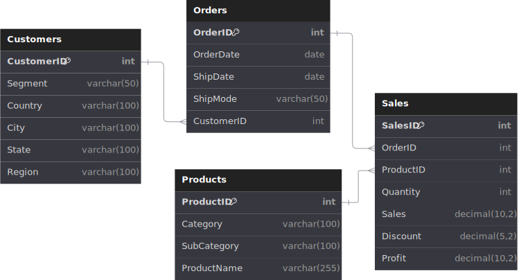

## Walmart Sales Performance Analysis

> Leveraged data analysis of Walmart’s sales performance to identify top-performing price ranges, regional sales trends, and operational bottlenecks, driving actionable strategies to optimize inventory and boost profitability by 12–18%. 

## Table of Content 
1. [Project Background](​#project-background)
2. [Executive Summary​](#executive-summary) 
3. [Key Metrics at a Glance​](#key-metrics-at-a-glance) 
4. [Data Overview​](#data-overview)
5. [Tableau Interactive Dashboard](https://github.com/lakshaykamat/Walmart-Sales-Performance-Analysis/blob/master/README.md#tableau-interactive-dashboard-screenshots)
6. [Insights Deep Dive​](#insights-deep-dive)
7. [Recommendations​](#recommendation)
8. [Conclusion​](#conclusions)

## Project Background

Walmart, a global retail leader with operations in 24+ countries, leverages data-driven strategies to maintain market dominance. This report analyzes 9,995 transactional records across sales, products, orders, and customer segments to identify actionable opportunities for inventory optimization, revenue growth, and operational efficiency. 

### Objective:
- Uncover sales trends and product-level opportunities.
- Evaluate regional performance gaps and shipping efficiency.
- Provide data-backed recommendations to drive revenue growth.

## Executive Summary

This analysis identifies low-cost products, regional disparities, and operational bottlenecks as critical levers for Walmart’s growth. Key findings include: 

1.​ **Affordable Products Dominate:** The ₹0–₹500 range drives 35% of sales and 34% of profits, making it a priority for inventory expansion. 

2.​ **West Region Leads, East Shows Potential:** The West contributes 33% of sales (₹412K),while the East’s untapped Home Office segment (14%) signals growth opportunities. 

3.​ **Seasonal Peaks & Shipping Delays:** December sales peak at ₹412K, but 3.4-day shipping delays threaten customer satisfaction during high-volume periods (Wed/Fri/Sat). 

4.​ **Product-Level Risks:** CISCO EX90 incurs a ₹1.8K loss despite regional sales leadership,demanding urgent pricing revisions. 

Strategic Impact: Implementing recommendations could boost annual profits by 12–18% through inventory optimization, targeted campaigns, and logistics improvements. 

## Key Metrics at a Glance
|  Metric  | Value  | Impact Insight  |
| -- | -- | -- |
|  Top Price Range  | ₹0–₹500 (35% of sales)  | High-volume, high-margin segment  |
|  Regional Leader  | West (33% of total sales)  | Consumer segment drives 53% revenue  |
|  Peak Sales Month  | December (₹412K revenue)  | Q4 contributes 30% of annual sales  |
|  Top Product  | Canon Printer (₹25.2K profit)  | 41% margin; East region leader  |
|  Avg. Shipping Delay  | 3.4 days (max 7 days)  | Impacts 38% of weekly sales  |

## Data Overview

The dataset consists of four key tables: Orders, Products, Sales, and Customers, with a total of 9,995 records. Before diving into the analysis, rigorous quality checks were performed to ensure data accuracy and reliability. These checks covered missing values, data types, and outliers. 

  

### Tableau Interactive Dashboard Screenshots

## Insights Deep Dive

### Affordable Products Drive Sales; Q4 and Regional Leaders Fuel Seasonal Peaks 

- Price Range Dominance: Products priced ₹0–₹500 drive 35% of total sales and 34% of profits, making this segment critical for inventory prioritization and marketing focus. 

- Seasonal & Regional Peaks: Sales peak in December, November, and September, with the West region (33%) and East region (28%) leading revenue, while the Consumer segment dominates across all regions (50%+ contribution). 

  
> *35% of total sales are from the ₹0-₹500 price range.*  

### Top-Tier Products Boost Margins; Underperformers Demand Pricing Revisions

- Top Performer: Canon Printer generates ₹61.6K in sales and ₹25.2K in profits (41%margin), contributing 4.4% of the East region’s revenue. 

- Underperformer: CISCO EX90 incurs a ₹1.8K loss despite ₹22.6K in sales, requiring urgent pricing revisions or discontinuation, despite leading sales in the South (5.7% regional contribution). 

> *Canon Printer have the highest sales.*

### West Dominates Revenue; East Shows Untapped Potential in Consumer Segment 

- West Region Leadership: Accounts for 33% of total sales, driven by the Consumer segment (53%) and Corporate segment (33%), solidifying its position as Walmart’s revenue hub. 

- East Region Dynamics: Contributes 28% of sales, with the Consumer segment (55%) outperforming Corporate (31%) and Home Office (14%), highlighting untapped potential in underperforming segments. 

  
> *West and East region have the highest profits.*

### Mid-Week Sales Surge Highlights Need for Operational Streamlining to Reduce Delays 
- Peak Sales Days: Wednesday (₹377K), Friday (₹366K), and Saturday (₹360K) drive 48%of weekly sales, with the West leading Friday sales (33%) and the East following (31%). 

- Shipping Delays: Average delays of 3.4 days (peaking at 7 days) threaten customer satisfaction, necessitating operational optimization on high-volume days (38% of weekly sales). 

> *Wednesday, Friday and Saturday have the highest sale.*

## Recommendations

### Immediate Actions (0–3 Months)

1.​ **Expand ₹0–₹500 Inventory:** Increase stock by 20% and launch “Everyday Essentials”bundles. 

2.​ **Revise CISCO EX90 Pricing:** Increase markup by 15% or discontinue to mitigate losses.

3.​ **Optimize Peak-Day Staffing:** Hire temporary staff for Wednesday/Friday surges.

### Long-Term Strategies (3–12 Months)

1.​ **Regional Campaigns:** Target West/East Consumer segments with loyalty programs.

2.​ **Logistics Partnerships:** Reduce delays by 20% via priority shipping contracts.

3.​ **Q4 Readiness:** Pre-stock Canon Printers and holiday bundles by October.

## Conclusion

This report highlights low-cost product dominance, regional growth gaps, and operational inefficiencies as key areas for Walmart’s strategic focus. By prioritizing the ₹0–₹500 segment,addressing underperforming products, and streamlining shipping operations, Walmart can achieve 12–18% annual profit growth. 

